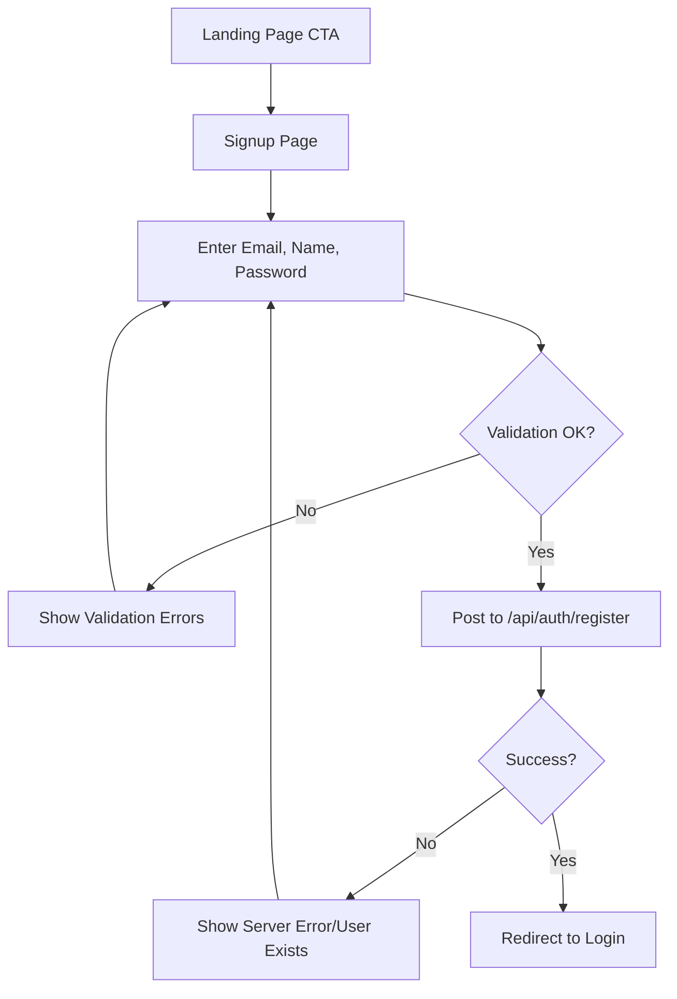
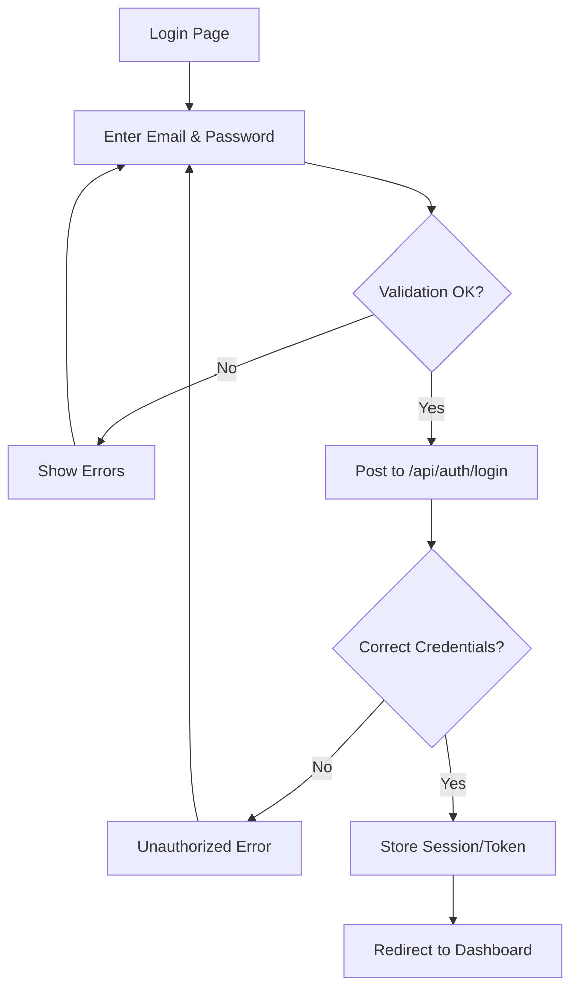

# Auth (Login & Signup) - Specification

This document defines the authentication flow for Ticketin, covering user registration and secure login.

**Version:** 0.1.0  
**Owner:** Yourin  
**Last Updated:** 2026-05-26

## Objectives

- Provide a seamless and secure onboarding experience (Signup).
- Allow existing users to access their dashboard (Login).
- Ensure data integrity and password security.

## Actors and Permissions

| Actor/Role | Permissions |
| --- | --- |
| Guest | Can access Signup and Login pages. |
| User | Can authenticate and transition to the Dashboard. |

## User Flow (Signup)

## User Flow (Login)

## Acceptance Criteria

1. User can create an account with valid data.
2. User cannot create an account with an existing email.
3. User can log in with correct credentials.
4. "Get Started" and "Login" buttons on the landing page point to the correct routes.
5. Dark mode support for both pages.
