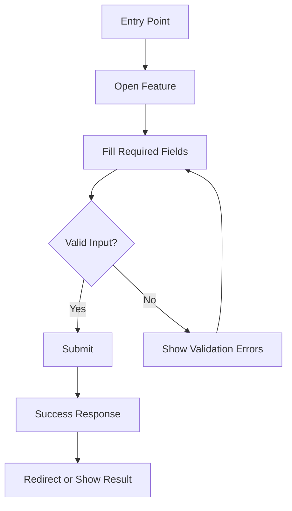
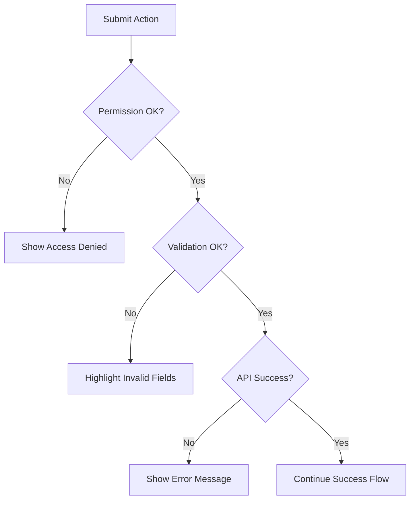
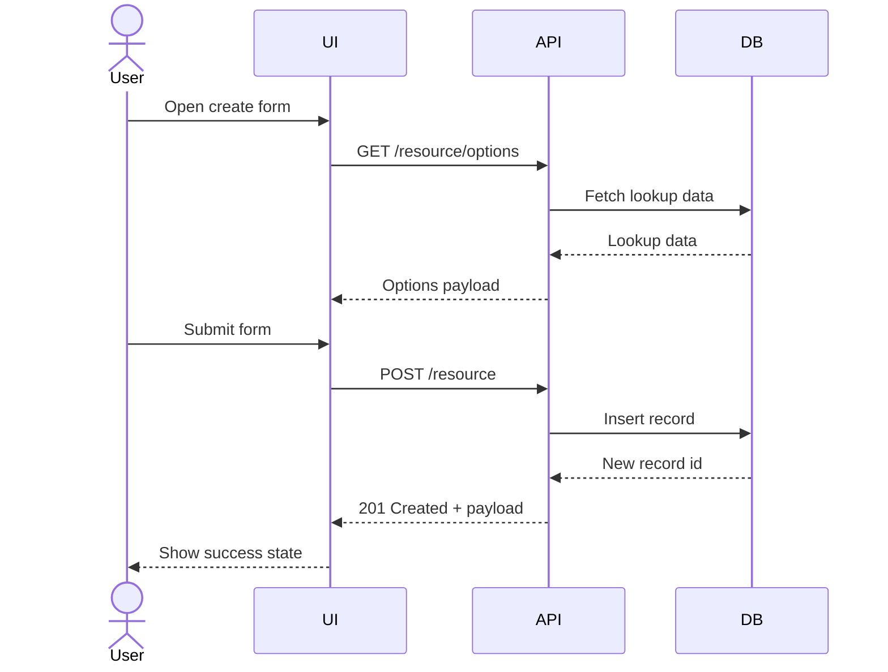
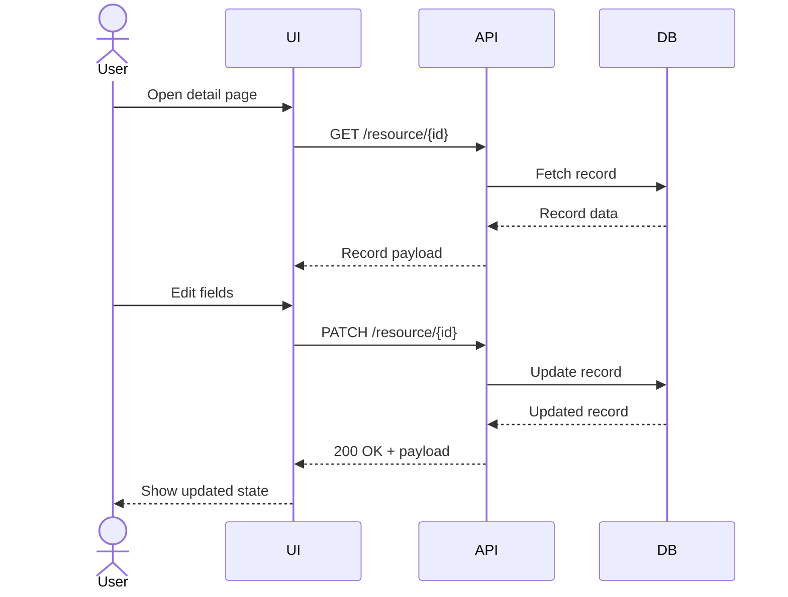
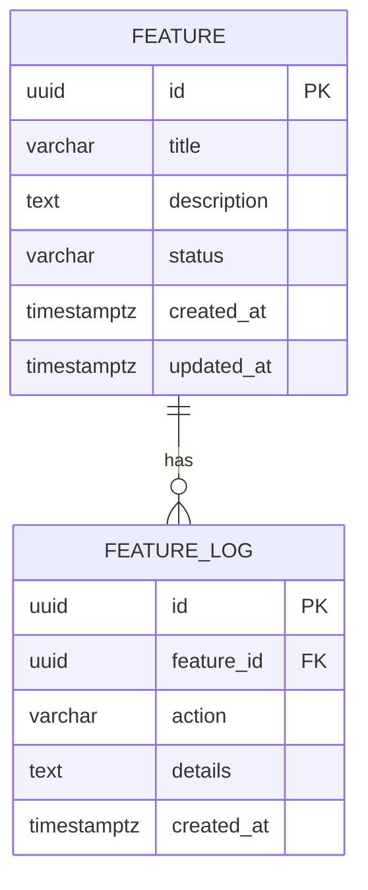

# Docs Specification - Feature

Summary of the feature in 3-6 sentences. Include user goal, business value, and scope boundaries.

**Version:** 0.1.0  
**Owner:** <name>  
**Last Updated:** YYYY-MM-DD

## <Feature Name> - Create

### Objectives

- Objective 1 (measurable outcome).
- Objective 2 (measurable outcome).

### Assumptions and Constraints

- Assumption or dependency.
- Technical or compliance constraint.

### Actors and Permissions

| Actor/Role | Permissions |
| --- | --- |
| Agent | Describe allowed actions. |
| Supervisor | Describe allowed actions. |

### User Flow (Main)

Purpose: Primary user journey from entry to completion, focused on the happy path and key decisions.

### Error and Validation Flow

Purpose: Validation, permission, and system error paths, including user feedback and recovery behavior.

### Sequence Diagram - Create

Purpose: UI to API interactions for the create flow, including lookup calls and record insertion.

### Acceptance Criteria

1. User can complete the main flow without errors.
2. Validation messages appear for missing or invalid fields.
3. Successful submission produces the expected result.

## <Feature Name> - Update

### Objectives

- Objective 1 (measurable outcome).
- Objective 2 (measurable outcome).

### Assumptions and Constraints

- Assumption or dependency.
- Technical or compliance constraint.

### Actors and Permissions

| Actor/Role | Permissions |
| --- | --- |
| Agent | Describe allowed actions. |
| Supervisor | Describe allowed actions. |

### User Flow (Main)

### Sequence Diagram - Update

Purpose: UI to API interactions for update flow, including permission checks and side effects.

### Acceptance Criteria

1. User can complete the main flow without errors.
2. Validation messages appear for missing or invalid fields.
3. Successful submission produces the expected result.

## Shared Diagrams and References

### Error and Validation Flow

Purpose: Validation, permission, and system error paths, including user feedback and recovery behavior.

### Data Model (ERD)

Purpose: Tables, relations, and key constraints required by this feature.

### API Contract Reference

| No | File | Description |
| --- | --- | --- |
| 1 | [contract-api/feature-openapi.yaml](contract-api/feature-openapi.yaml) | OpenAPI spec for endpoints, schemas, and errors. |

### Mock Data Reference

| No | File | Description |
| --- | --- | --- |
| 1 | [mockoon/feature-mock.json](mockoon/feature-mock.json) | Mock endpoints and sample payloads. |

### State or Status Lifecycle (Optional)

Describe status transitions and any SLA rules.

### Edge Cases

- Duplicate submissions
- Partial failures or retries
- Permission edge cases

### Observability

- Logs required
- Audit trail events
- Metrics/alerts

## Change Log

| Date | Author | Change |
| --- | --- | --- |
| YYYY-MM-DD | Name | Initial draft. |