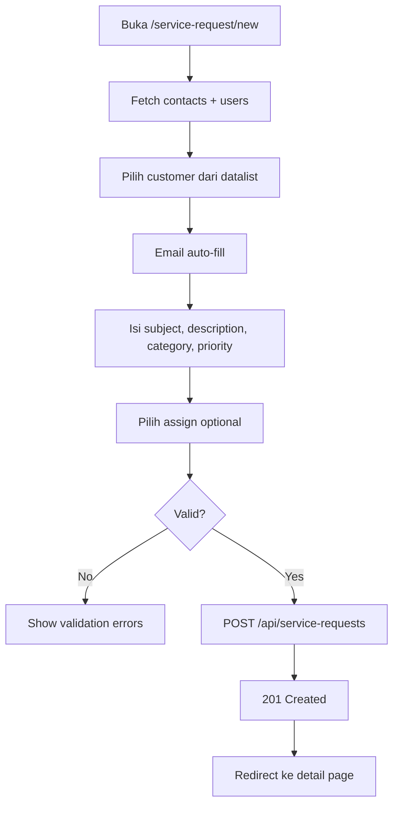
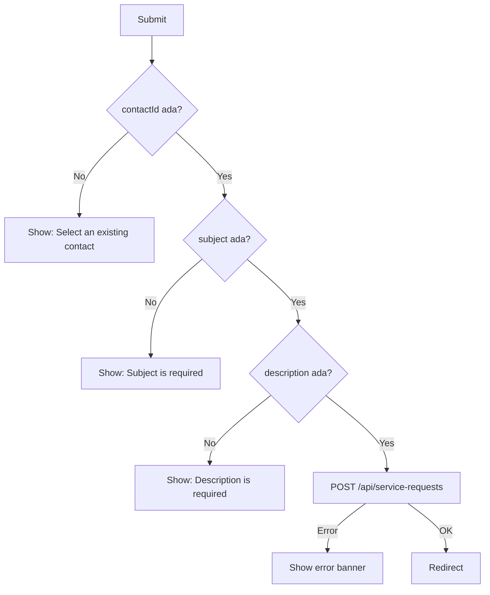
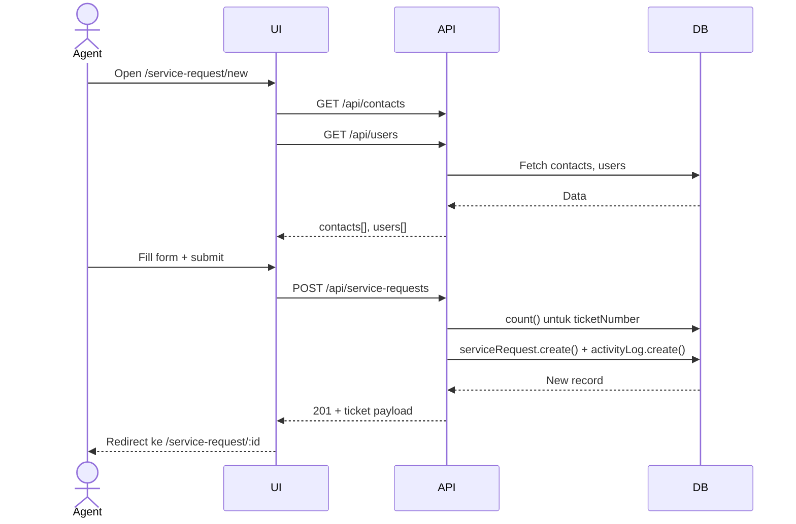
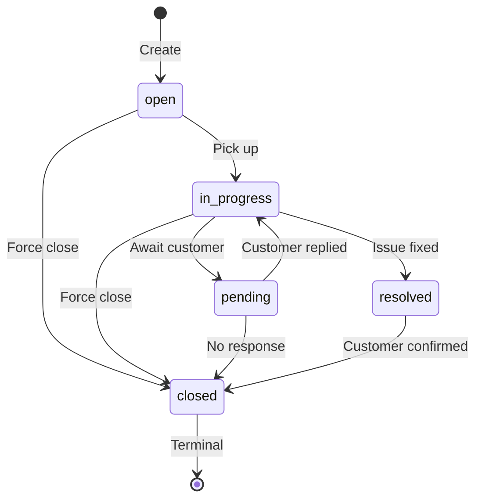
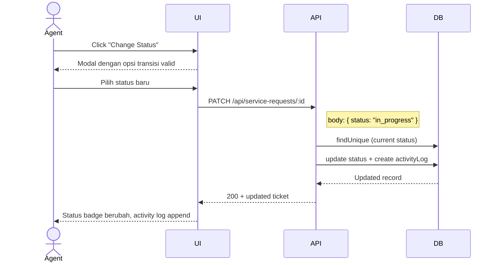
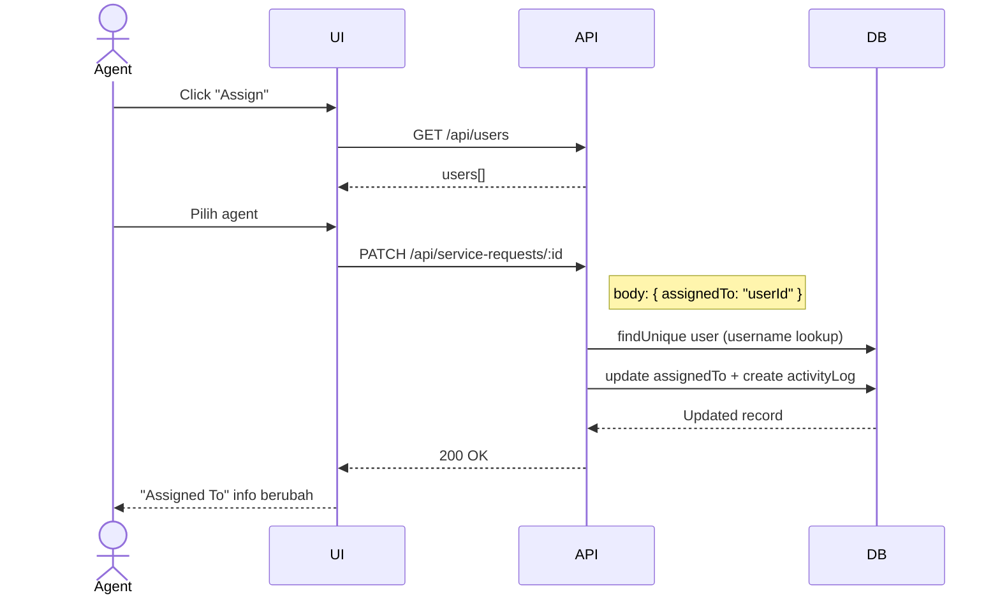
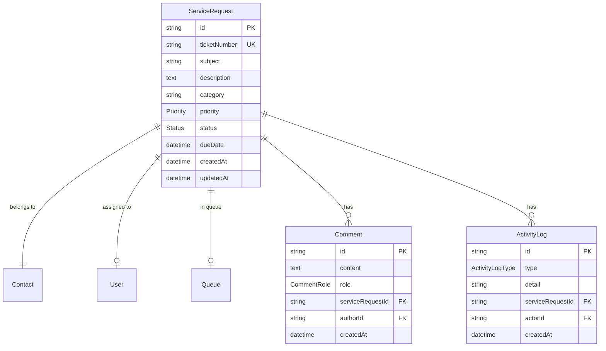

# Docs Specification - Service Request

Modul Service Request memungkinkan agent mengelola tiket dukungan pelanggan. Agent dapat membuat tiket baru, melihat daftar tiket, mengubah status, menugaskan agent, dan menambahkan komentar. Tiket terhubung ke Contact (customer) yang sudah ada di sistem.

**Version:** 1.0.0  
**Owner:** Rizqy Yourin  
**Last Updated:** 2026-06-02

---

## Service Request - Create

### Objectives

- Agent dapat membuat tiket baru dengan memilih contact yang sudah ada.
- Tiket otomatis mendapat `ticketNumber` (SR0001, SR0002, ...) dan SLA deadline berdasarkan priority.

### Assumptions and Constraints

- `contactId` wajib — customer harus sudah ada di modul Contact.
- Status awal selalu `open`.
- `ticketNumber` di-generate server-side (`SRxxxx`, increment dari count).
- SLA: low=24h, medium=12h, high=8h dari `createdAt`.

### Actors and Permissions

| Actor/Role | Permissions |
| --- | --- |
| Agent | Create ticket untuk contact existing. |
| Supervisor | Create ticket + assign langsung saat create. |

### User Flow (Main)



### Error and Validation Flow



### Sequence Diagram - Create



### API Endpoint - Create

**`POST /api/service-requests`**

Request body:
```json
{
  "subject": "Cannot login to application",
  "description": "User cannot login since yesterday...",
  "category": "Technical Support",
  "priority": "high",
  "contactId": "clx...",
  "assignedTo": "clx...",
  "dueDate": "2026-06-03T06:00:00.000Z"
}
```

Response `201 Created`:
```json
{
  "id": "clx...",
  "ticketNumber": "SR0003",
  "status": "open",
  "contact": { ... },
  "activityLogs": [{ "type": "created", ... }]
}
```

### Acceptance Criteria

1. Tiket baru muncul di list page setelah create.
2. `ticketNumber` format `SR` + 4 digit zero-padded.
3. `activityLog` entry `created` otomatis terbuat.
4. Validasi: contactId wajib dari existing contacts.

---

## Service Request - Update (Status & Assignment)

### Objectives

- Agent mengubah status tiket mengikuti state machine yang terdefinisi.
- Agent/Supervisor menugaskan tiket ke user tertentu.

### Actors and Permissions

| Actor/Role | Permissions |
| --- | --- |
| Agent | Change status, assign (jika punya akses). |
| Supervisor | Change status, assign ke siapa saja. |

### Status Lifecycle



### Sequence Diagram - Update Status



### Sequence Diagram - Assign



### API Endpoint - Update

**`PATCH /api/service-requests/:id`**

Request body (partial — semua field optional):
```json
{
  "status": "in_progress",
  "assignedTo": "clx..."
}
```

Response `200 OK` — full ticket dengan contact + assignedUser.

---

## Service Request - Comment

### API Endpoint - Add Comment

**`POST /api/service-requests/:id/comments`**

Request body:
```json
{
  "content": "I have reviewed your issue and will investigate.",
  "role": "agent"
}
```

Response `201 Created`:
```json
{
  "id": "clx...",
  "content": "...",
  "role": "agent",
  "createdAt": "...",
  "author": { "username": "rizky.a" }
}
```

Side effect: `activityLog` entry `comment` otomatis terbuat.

---

## Shared Diagrams and References

### Data Model (ERD)



### Status Enum

| Value | Label | Color |
|---|---|---|
| `open` | Open | Blue |
| `in_progress` | In Progress | Violet |
| `pending` | Pending | Amber |
| `resolved` | Resolved | Emerald |
| `closed` | Closed | Zinc |

### Priority & SLA

| Priority | SLA Hours |
|---|---|
| `high` | 8h |
| `medium` | 12h |
| `low` | 24h |

### Edge Cases

- Contact tidak ditemukan saat create → validasi FE, link ke `/contact`
- Status `closed` → terminal, tidak bisa transisi
- Unassign: kirim `{ assignedTo: null }` ke PATCH
- Comment oleh customer (`role: "customer"`) → untuk future email webhook integration

### Observability

- Setiap perubahan status: `ActivityLog` entry `status_change`
- Setiap assign/unassign: `ActivityLog` entry `assignment`
- Setiap comment: `ActivityLog` entry `comment`
- Create: `ActivityLog` entry `created` (di-create dalam satu transaction saat POST)

---

## Change Log

| Date | Author | Change |
| --- | --- | --- |
| 2026-06-02 | Rizqy | Initial draft — backend integration complete. |
