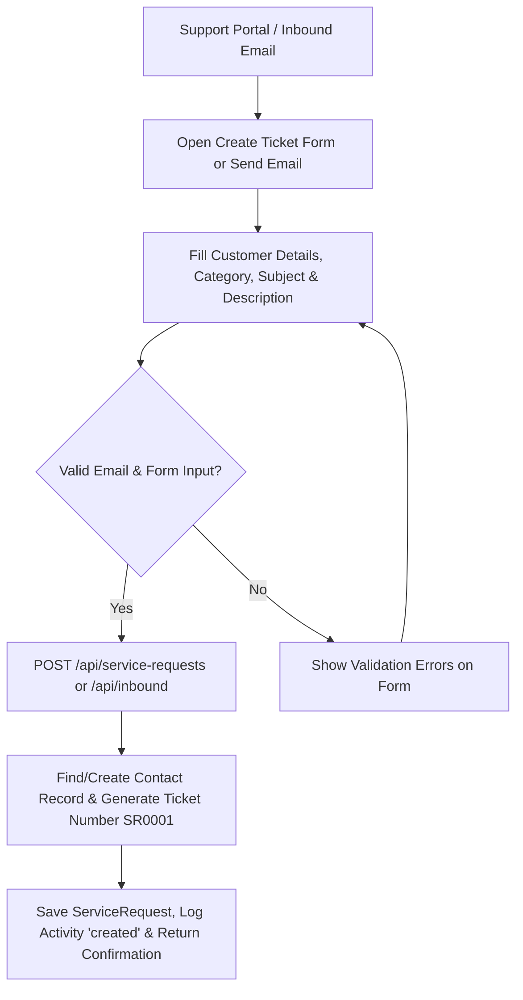
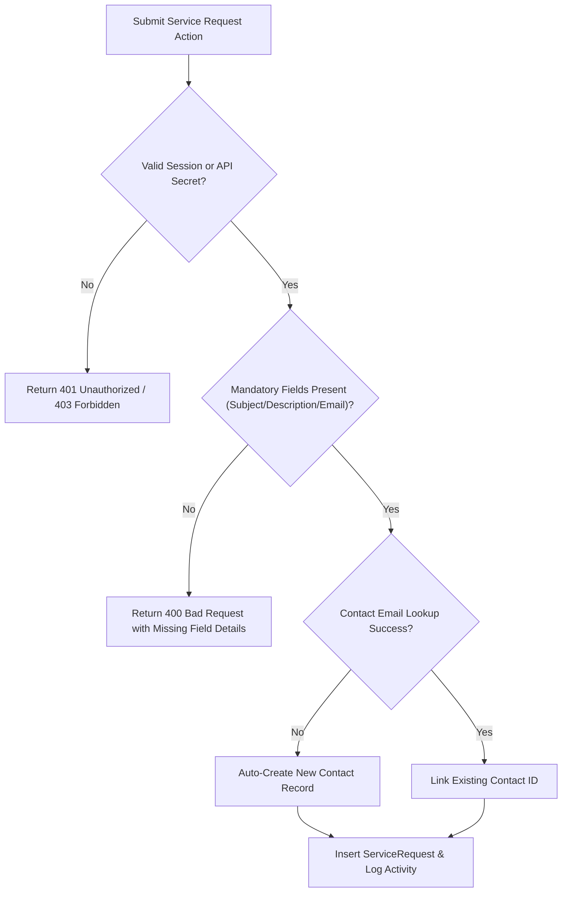
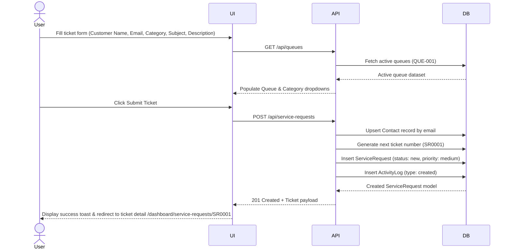
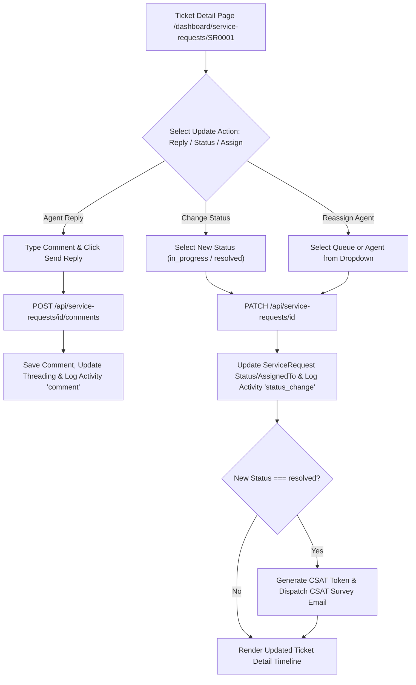
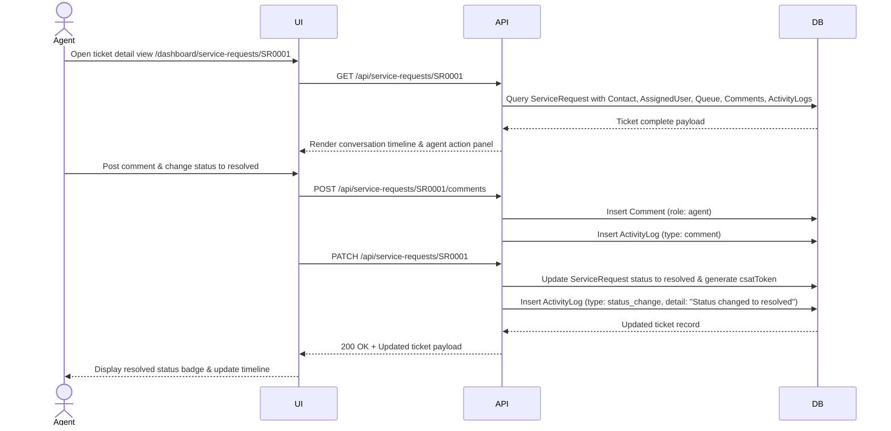
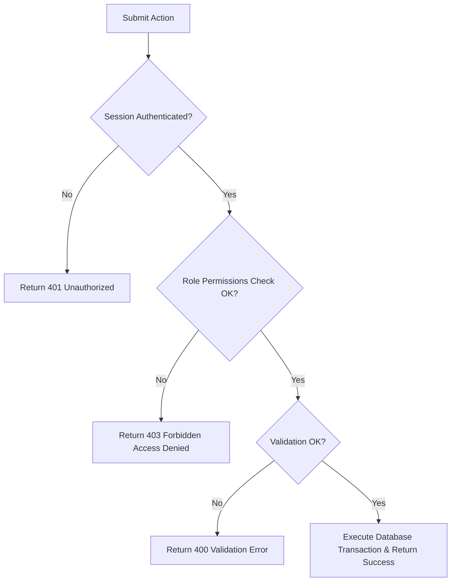
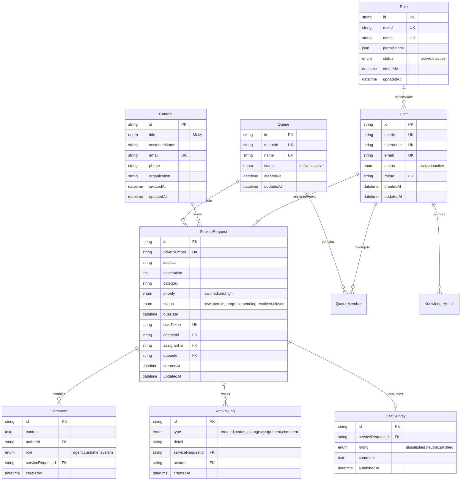

# Docs Specification - Customer Support Ticket Management

The Customer Support Ticket Management feature powers Ticketin's email-first CRM workflow by managing customer support inquiries, queue routing, agent assignments, comment threading, activity auditing, and Customer Satisfaction (CSAT) surveys. Built with Next.js (App Router), TypeScript, Tailwind CSS, shadcn/ui, and Prisma ORM, it parses inbound customer email webhooks (`/api/inbound`) into tracked service requests (`SR0001`) with unique `emailThreadId` anchors. Scope covers ticket creation, queue routing, status transitions (`new` -> `open` -> `in_progress` -> `pending` -> `resolved` -> `closed`), priority assignment (`low`, `medium`, `high`), agent commenting, activity logging, knowledge base linking, and CSAT survey generation.

**Version:** 0.1.0  
**Owner:** Rizqy  
**Last Updated:** 2026-07-27

## Customer Support Ticket Management - Create

### Objectives

- Ingest customer support inquiries via API (`POST /api/service-requests`) or email webhook (`POST /api/inbound`) and generate a service request (`SR0001`) within 3 seconds.
- Automatically link or create `Contact` records, assign initial status `new`, assign queue routing, and log `ActivityLog` type `created`.

### Assumptions and Constraints

- Customer email must be valid and linked to a `Contact` record.
- Default queues and priority levels (`medium` default) must be configured in system database.
- Unique `ticketNumber` sequence (e.g. `SR0001`) generated atomically.

### Actors and Permissions

| Actor/Role | Permissions |
| --- | --- |
| Admin / Supervisor | Full access: `tickets.create`, `tickets.view`, `tickets.edit`, `tickets.delete`, `tickets.assign`, `queues.manage`, `rbac.manage` |
| Agent | `tickets.create`, `tickets.view`, `tickets.edit`, `comments.create`, `knowledge.view` |
| Customer / Inbound Email | Can trigger ticket creation via contact form or inbound email webhook |

### User Flow (Main)

Purpose: Primary user journey from entry to completion, focused on the happy path and key decisions.

### Error and Validation Flow

Purpose: Validation, permission, and system error paths, including user feedback and recovery behavior.

### Sequence Diagram - Create

Purpose: UI to API interactions for the create flow, including lookup calls and record insertion.

### Acceptance Criteria

1. Submitting the ticket form or sending an email parses details, upserts `Contact`, and creates a `ServiceRequest` with number `SR0001`.
2. Missing email or subject fields returns a `400 Bad Request` with field error descriptions.
3. Creation logs an `ActivityLog` entry (`type: created`) and sets initial status to `new`.

## Customer Support Ticket Management - Update

### Objectives

- Support ticket status transitions (`new` -> `open` -> `in_progress` -> `pending` -> `resolved` -> `closed`), agent reassignment, and comment threading.
- Generate CSAT survey tokens (`csatToken`) automatically upon transitioning status to `resolved` or `closed` and send survey invitation emails.

### Assumptions and Constraints

- Only assigned agents or supervisors with `tickets.edit` permission can update ticket status or assign agents.
- Resolved or closed tickets trigger CSAT survey token generation (`CsatSurvey`).

### Actors and Permissions

| Actor/Role | Permissions |
| --- | --- |
| Admin / Supervisor | Reassign queues/agents, override status, modify due dates, view activity logs |
| Agent | Update status (`in_progress`, `resolved`), post agent comments, log internal notes |
| Customer | Add customer comments via email reply, submit CSAT survey rating (`dissatisfied`, `neutral`, `satisfied`) |

### User Flow (Main)

### Sequence Diagram - Update

Purpose: UI to API interactions for update flow, including permission checks and side effects.

### Acceptance Criteria

1. Agents can post replies (`Comment` role: `agent`) and update ticket status (`in_progress`, `resolved`, `closed`).
2. Status changes and agent assignments generate immutable `ActivityLog` records (`status_change`, `assignment`).
3. Marking a ticket as `resolved` generates a unique `csatToken` for customer feedback.

## Shared Diagrams and References

### Error and Validation Flow

Purpose: Validation, permission, and system error paths, including user feedback and recovery behavior.

### Data Model (ERD)

Purpose: Tables, relations, and key constraints required by this feature.

### API Contract Reference

| No | File | Description |
| --- | --- | --- |
| 1 | [contract-api/feature-openapi.yaml](contract-api/feature-openapi.yaml) | OpenAPI spec for Ticketin service requests, comments, contacts, queues, and CSAT endpoints. |

### Mock Data Reference

| No | File | Description |
| --- | --- | --- |
| 1 | [mockoon/feature-mock.json](mockoon/feature-mock.json) | Mock endpoints and sample JSON payloads for Ticketin tickets, queues, and activity logs. |

### State or Status Lifecycle (Optional)

Service Requests follow the status lifecycle: `new` -> `open` -> `in_progress` -> `pending` -> `resolved` -> `closed`. CSAT surveys trigger automatically upon entering `resolved` or `closed` state.

### Edge Cases

- **Duplicate Email Inbound Webhook**: Concurrent customer emails creating duplicate contacts are prevented via Prisma `upsert` by unique email.
- **Unassigned Queue Routing**: Tickets created without a specified queue are auto-assigned to the default general support queue.
- **CSAT Double Submission**: Re-submitting a CSAT survey token returns a 409 Conflict if `CsatSurvey` already exists for `serviceRequestId`.

### Observability

- **Activity Log Audit Trail**: Every status change, assignment, creation, or comment generates an immutable `ActivityLog` entry with `actorId` and timestamp.
- **CSAT Rating Metrics**: Aggregated CSAT satisfaction ratings (`dissatisfied`, `neutral`, `satisfied`) monitored on the main support dashboard.
- **Queue Member Tracking**: Membership mappings between users and queues tracked in `QueueMember` for agent workload metrics.

## Change Log

| Date | Author | Change |
| --- | --- | --- |
| 2026-07-27 | Rizqy | Updated specification after comprehensive audit of Ticketin Prisma schema, API routes, RBAC permissions, and CSAT workflows. |
